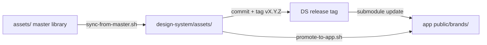

# Sync strategy

How the design system stays in sync with the monorepo master library and consuming apps.

## Sources of truth

| Layer | Location | Owns |
|-------|----------|------|
| **Brand masters** | `ligas-de-tenis/assets/` (monorepo, gitignored) | PDF kits, print masters, full `catalog.csv`, extraction pipeline |
| **Design system** | This repo (`assets/`, tokens, docs, preview) | Web-ready curated assets, visual tokens, component contracts |
| **Apps** | e.g. `maria-esther-panel/public/brands/` | Runtime copies used by deployed UI |

**Rule:** data flows one way — masters → design system → apps. Apps never define new logo files; they consume from the design system.

## Recommended consumption (standalone repo)

Use a **git submodule** pinned to a semver tag:

```bash
# In ligas-de-tenis or maria-esther-panel
git submodule add https://github.com/luccmattos/ligas-de-tenis-design-system.git design-system
cd design-system && git checkout v2.0.0 && cd ..
```

Environment variables for scripts (optional overrides):

```bash
export LIGAS_MONOREPO_ROOT=/path/to/ligas-de-tenis/ligas-de-tenis
export LIGAS_APP_ROOT=/path/to/maria-esther-panel   # optional override for promote
```

**Local layout (one checkout — submodule only):**

```
ligas-de-tenis/ligas-de-tenis/          ← monorepo (master assets gitignored)
└── design-system/                      ← this repo (git submodule @ semver tag)
```

Do **not** keep a second local clone of this repo beside the monorepo; edit, sync, tag, and push from `design-system/` only.

Scripts auto-detect the monorepo when this repo is the submodule at `ligas-de-tenis/design-system/` (parent directory = monorepo root).

Why submodule (for now):

- Tokens, assets, and preview are static files — no npm build required
- Exact paths for logos match `assets/logos/` naming
- Tags give reproducible releases (`v2.0.0`, `v2.0.1`)
- npm package can be added later for Tailwind token codegen only

**Not recommended:** manual copy between repos (drift within weeks).

## Workflows

### A. New or updated brand asset (normal path)



1. Update master library in monorepo (`assets/vectors/source/`, run `organize_assets.py` if needed).
2. Refresh curated web set:

   ```bash
   ./scripts/sync-from-master.sh
   ```

3. Review diff, update `CHANGELOG.md`, commit in design-system repo.
4. Tag release: `git tag v2.0.1 && git push origin v2.0.1`
5. In consuming repos: `git submodule update --remote design-system`
6. Promote logos needed at runtime:

   ```bash
   ./scripts/promote-to-app.sh
   ```

7. Update `assets/catalog.csv` in monorepo: set `repo_status=committed` for promoted rows.

### B. Token or component change (no new logos)

1. Edit `tokens/`, `components/`, or `guidelines/` in design-system repo.
2. Regenerate bundle if components changed: `cp previews/reference/_ds_bundle.js ds-bundle.js`
3. Tag patch release (`v2.0.2`).
4. Consumers update submodule; run app build/tests.

### C. App-only hotfix (emergency)

If production needs a logo before a DS release:

1. Copy file to `public/brands/` temporarily.
2. **Within 48h:** backport the same file into `design-system/assets/` and cut a patch tag.
3. Never leave app-only assets without a DS counterpart.

## What syncs automatically vs manually

| Item | Sync |
|------|------|
| Logo SVG/PNG/favicons | `sync-from-master.sh` |
| Tournament badge SVGs | `sync-from-master.sh` |
| Product banners (PNG) | `sync-from-master.sh` |
| `manifest.csv` | Regenerated by sync script |
| Tokens / components | Git only (DS repo) |
| `quarantine/` | Never synced (local `.gitignore`) |
| PDF masters | Stay in monorepo master only |

## Layout

**GitHub:** standalone repo `ligas-de-tenis-design-system` (public, semver tags).

**Local (monorepo):**

```
ligas-de-tenis/ligas-de-tenis/
├── design-system/    ← git submodule → ligas-de-tenis-design-system (work here)
├── assets/           ← master library (gitignored)
└── apps/
    └── maria-esther-panel/
        ├── design-system/   ← submodule in deploy repo (same remote)
        └── public/brands/   ← promoted subset
```

## Version policy

| Change | Bump |
|--------|------|
| New logo, badge, or product asset | MINOR (`2.1.0`) |
| Token/component breaking API | MAJOR (`3.0.0`) |
| Token tweak, doc fix, preview fix | PATCH (`2.0.1`) |

## Checklist before tagging a release

- [ ] `./scripts/sync-from-master.sh` run (if assets changed)
- [ ] `previews/index.html` loads correctly (`python3 -m http.server 8787`)
- [ ] `assets/manifest.csv` matches files on disk
- [ ] `CHANGELOG.md` updated
- [ ] No files from `quarantine/` staged
